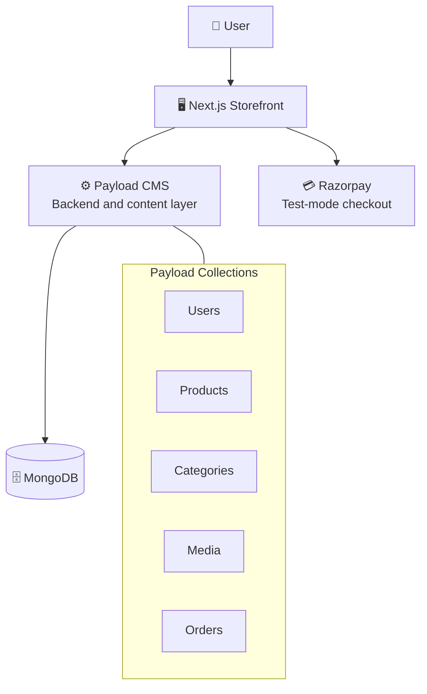
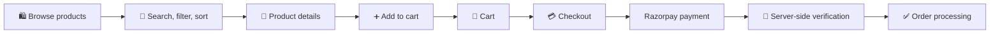
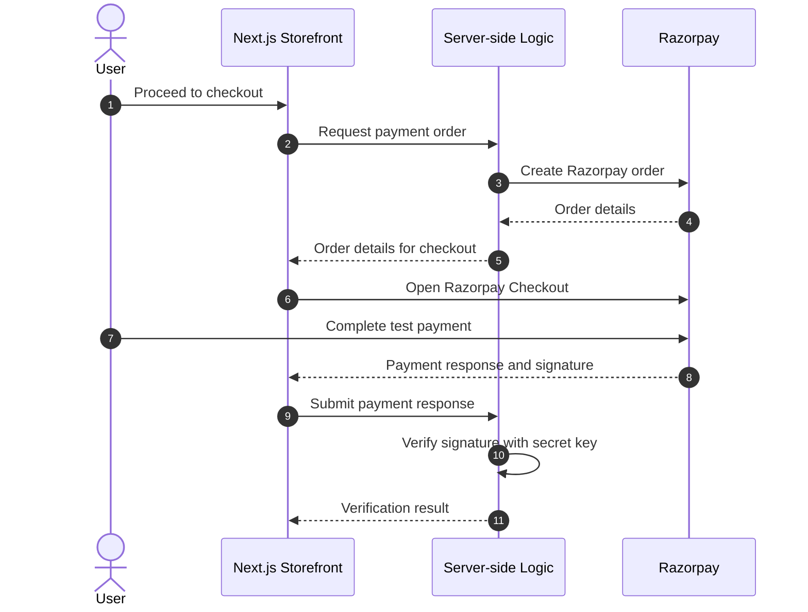

<div align="center">

# 🛍️ ShopSphere

**An ecommerce storefront built with Next.js and Payload CMS, backed by MongoDB, with Razorpay test-mode checkout.**

[](https://shopsphere-nu-orpin.vercel.app/)


</div>

---

<!--
## 📸 Screenshots

Add screenshots to docs/screenshots/ and uncomment this section.

| Product Listing | Product Details |
|:---:|:---:|
|  |  |

| Search and Filters | Shopping Cart |
|:---:|:---:|
|  |  |

| User Profile | Payload CMS Dashboard |
|:---:|:---:|
|  |  |
-->

## 🔭 Overview

ShopSphere is a CMS-backed ecommerce storefront. The customer-facing application is built with **Next.js**, while **Payload CMS** provides the backend and content layer: authentication, structured collections for products, categories, media and orders, and an admin interface for managing the catalog. Data is persisted in **MongoDB**.

Products are managed through the CMS rather than hardcoded in the frontend, and checkout is wired to **Razorpay** with server-side payment verification. The project was built to cover the full flow of a real storefront (catalog, accounts, cart, payment, data seeding and deployment) rather than only the UI.

### ⚙️ Engineering highlights

- 📦 Product catalog driven by Payload CMS collections, not static frontend data
- 👤 Authenticated user accounts with editable profiles and avatar support
- 🔎 Product search, filtering and sorting
- 🔐 Razorpay checkout with **server-side signature verification**, so payment results are not trusted from the client alone
- 🌱 Seed scripts for products and product images to make local setup repeatable
- 🐳 Docker Compose setup for a local MongoDB instance
- 🧩 TypeScript throughout, with Payload type generation, ESLint and a production build workflow

<!--
Add this only after verifying the numbers against the codebase:

Built with 15+ application modules, 25+ reusable React components, 10+ API endpoints and 5+ Payload CMS collections.
-->

---

## ✨ Features

| Area | What it includes |
|------|------------------|
| 🛍️ **Catalog** | Product listing, detail pages, categories, product images and pricing, all managed in Payload CMS |
| 🔎 **Discovery** | Search, filtering, sorting and category-based browsing |
| 👤 **Accounts** | Signup and login, user profile with name, age and avatar, editable profile information, avatar thumbnail in the navigation |
| 🛒 **Cart** | Add products, view the cart, adjust quantities, cart totals, proceed to checkout |
| 💳 **Payments** | Razorpay order creation, Razorpay Checkout (test mode), server-side payment signature verification |
| 🗄️ **Content and data** | Payload collections for Users, Products, Categories, Media and Orders, with MongoDB persistence |
| 🧪 **Developer workflow** | Seed scripts, Docker-based local MongoDB, Payload type generation, linting and production builds |

---

## 🧰 Tech Stack

| Layer | Technologies |
|-------|--------------|
| 🖥️ **Frontend** |      |
| ⚙️ **Backend / CMS** |   |
| 🗄️ **Database** |  |
| 💳 **Payments** |   |
| 🛠️ **Tooling** |      |

---

## 🏗️ Architecture



**Role of each layer**

- 🖥️ **Next.js** renders the storefront: product browsing, search, filtering, cart, profile and checkout screens, plus server-side logic for the payment flow.
- ⚙️ **Payload CMS** owns the structured data model and authentication, handles media uploads, and gives administrators a dashboard for managing products and content.
- 🗄️ **MongoDB** stores the data behind every Payload collection.
- 💳 **Razorpay** handles payment collection in test mode.

### 🔄 Application flow



---

## 🗄️ Data Model

Content and application data live in Payload collections.

| Collection | Purpose |
|------------|---------|
| 👤 **Users** | Customer accounts, authentication, profile information and avatar |
| 📦 **Products** | Product information, pricing, images and category association |
| 🏷️ **Categories** | Organizes products into browsable categories |
| 🖼️ **Media** | Uploaded files such as product images and user avatars |
| 🧾 **Orders** | Order data associated with checkout and payment |

---

## 🔐 Authentication and Profiles

  

Users can sign up and log in, and the storefront adapts to the signed-in user.

- 📝 Account creation and login handled through Payload's authentication
- 🙋 Profile page with name, age and avatar, all editable
- 🖼️ Avatar thumbnail displayed in the navigation bar

---

## 🛒 Cart and Checkout

  

Users can add products to the cart, review items, adjust quantities and see cart totals before moving to checkout, where the Razorpay payment flow begins.

### 💳 Razorpay payment flow



🔐 **Server-side verification.** After a payment, Razorpay returns a response that includes a signature. ShopSphere verifies that signature on the server using the Razorpay secret instead of trusting client-side payment data. The secret key never reaches the browser.

> ⚠️ **Test mode only.** Razorpay is configured with test credentials. Normal development does not process real money, and the project does not claim production payment processing.

---

## 🚀 Getting Started

  

### 📋 Prerequisites

- Node.js and npm
- MongoDB, either installed locally or run through Docker
- A Razorpay account with test-mode API keys

### 1️⃣ Clone and install

```bash
git clone <repository-url>
cd ShopSphere
npm install
```

### 2️⃣ Configure environment variables

```bash
cp .env.example .env
```

| Variable | Description |
|----------|-------------|
| `DATABASE_URL` | MongoDB connection string used by Payload, for example `mongodb://127.0.0.1/ShopSphere` for local development |
| `PAYLOAD_SECRET` | Secret used by Payload to secure authentication. Use a long, random value |
| `RAZORPAY_KEY_ID` | Razorpay API key ID. Use a test key (`rzp_test_...`) in development |
| `RAZORPAY_KEY_SECRET` | Razorpay API secret, used on the server to create orders and verify payment signatures. Never expose it to the client |

```env
DATABASE_URL=mongodb://127.0.0.1/ShopSphere
PAYLOAD_SECRET=replace-with-a-long-random-secret
RAZORPAY_KEY_ID=rzp_test_replace_me
RAZORPAY_KEY_SECRET=replace-with-your-razorpay-test-secret
```

### 3️⃣ Start MongoDB

The repository includes Docker configuration for running MongoDB locally:

```bash
docker-compose up -d
```

This starts the database only; the application itself runs through npm.

### 4️⃣ Seed the catalog (optional)

```bash
npm run seed:products
npm run seed:product-images
```

These scripts create product records and product images so you have a working catalog without entering data by hand.

### 5️⃣ Run the app

```bash
npm run dev
```

---

## 📜 Scripts

| Command | Description |
|---------|-------------|
| `npm run dev` | ▶️ Start the development server |
| `npm run build` | 📦 Create a production build |
| `npm run start` | 🚀 Start the production application |
| `npm run lint` | 🧹 Run ESLint |
| `npm run generate:types` | 🧬 Generate Payload TypeScript types |
| `npm run seed:products` | 🌱 Seed product records |
| `npm run seed:product-images` | 🖼️ Seed product media and images |

<!--
## 📂 Project Structure

Check this against the actual repository before uncommenting, and adjust names to match.

```text
ShopSphere/
├── app/               # Next.js routes and pages
├── components/        # Reusable UI components
├── collections/       # Payload CMS collections
├── scripts/           # Data seeding scripts
├── payload.config.*   # Payload configuration
├── docker-compose.yml # Local MongoDB
├── .env.example
└── package.json
```
-->

---

## ☁️ Deployment

[](https://shopsphere-nu-orpin.vercel.app/)

ShopSphere is deployed on Vercel: **[shopsphere-nu-orpin.vercel.app](https://shopsphere-nu-orpin.vercel.app/)**

To deploy your own instance:

1. Run the checks locally:

   ```bash
   npm run lint
   npm run build
   ```

2. Set these environment variables in the hosting provider: `DATABASE_URL`, `PAYLOAD_SECRET`, `RAZORPAY_KEY_ID`, `RAZORPAY_KEY_SECRET`.
3. Make sure the MongoDB database is reachable from the deployed application.

---

## 🛡️ Security Considerations

- 🚫 Never commit `.env`. Keep real values in environment variables only.
- 🔑 Never expose `RAZORPAY_KEY_SECRET` to the client or in version control.
- 🧪 Use Razorpay **test** credentials for development and demos.
- 🎲 Use a long, random `PAYLOAD_SECRET`.
- ☁️ Store production credentials only in your hosting provider's secure environment settings.
- 🔒 Serve the application over HTTPS in production.

---

## 🗺️ Future Improvements


- [ ] Order history and order tracking
- [ ] Wishlist
- [ ] Product reviews and ratings
- [ ] Inventory management
- [ ] Coupons and discounts
- [ ] Admin analytics
- [ ] Email notifications
- [ ] Production Razorpay payments
- [ ] Automated tests and a CI/CD pipeline

---

## 👨‍💻 Author

**Adarsh Agarwal**, software developer focused on backend and full-stack web development. Final-year B.Tech CSE student at Amity University Lucknow, with internship experience at Tata Consultancy Services and W3villa Technologies.

[](https://github.com/AdarshAgarwal2005)
[](mailto:adarshagrawal2233@gmail.com)
